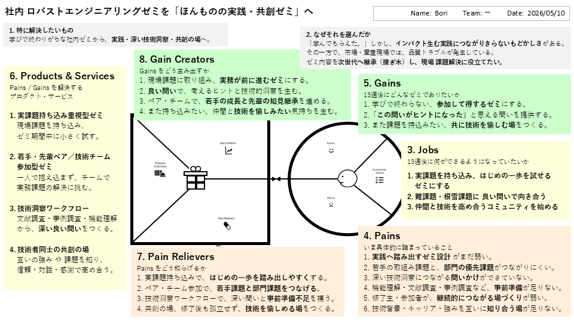

# VPC v1 - bori8472

> 「**自分や周りの人を顧客に設定**」したVPC。13週後の自分が欲しいもの・身近な人のために作りたいものを設計する。
> v1 でいい。完璧を目指さない。第6回でアップデート(v2)します。

---

## 1. 解決したい困りごとを 1つ 選ぶ

> [`bug-list.md`](./bug-list.md) の20個から、**「自分が一番これを解決したい!」と思うもの** を1つ選んでください。
> 1つに絞れなければ、複数候補を書いてOK(後で絞り込みます)。

**選んだ困りごと**:

3. ★ 「ほんものの技術評価」を看板として掲げているが、現場が求めている深い技術的洞察や、設計・製造判断に使える気づきまで十分に提供できているか不安がある。

---

## 2. その解決策のアイデアを書く

> 選んだ困りごとに対する「**こうだったらいいのに**」を1つ書く。
> 現実性は気にせず、自由に発想。

**解決のアイデア**:

社内ゼミを、学びで終わらせず、実践と深い技術洞察、共創の場に進化させる

---

## 3. VPC本体

> 上で選んだ「困りごと」と「解決のアイデア」を起点に、6要素を埋めていきます。

### 🟦 Customer Profile(顧客=自分自身)

#### Jobs(やりたいこと・動詞で書く)

- 1. 実課題を持ち込み、はじめの一歩を試せるゼミにする
- 2. 難課題・根雪課題に 良い問いで向き合う
- 3. 仲間と技術を高め合うコミュニティを始める

#### Pains(困っていること)

- 1. 実践へ踏み出すゼミ設計がまだ弱い。
- 2. 若手の取組み課題と、部門の優先課題がつながりにくい。
- 3. 深い技術洞察につながる問いかけができていない。
- 4. 機能理解・文献調査・事例調査など、事前準備が足りない。
- 5. 修了生・参加者が、継続的につながる場づくりが弱い。
- 6. 技術背景・キャリア・強みを互いに知り合う場が足りない。

#### Gains(得たい未来・状態)

- 1. 学びで終わらない、参加して得するゼミにする。
- 2. 「この問いがヒントになった」と思える問いを提供する。
- 3. また課題を持込みたい、共に技術を愉しむ場をつくる。

---

### 🟧 Value Map(あなたが作るもの)

#### Products & Services

- 1. 実課題持ち込み重視型ゼミ: 現場課題を持ち込み、ゼミ期間中に小さく試す。
- 2. 若手・先輩ペア／技術チーム参加型ゼミ: 一人で抱え込まず、チームで実務課題の解決に挑む。
- 3. 技術洞察ワークフロー: 文献調査・事例調査・機能理解から、深い良い問いをつくる。
- 4. 技術者同士の共創の場: 互いの強みや課題を知り、信頼・対話・感謝で高め合う。

#### Pain Relievers

- 1. 実課題持ち込みで、はじめの一歩を踏み出しやすくする。
- 2. ペア・チーム参加で、若手課題と部門課題をつなげる。
- 3. 技術洞察ワークフローで、深い問いと事前準備不足を補う。
- 4. 共創の場、修了後も孤立せず、技術を愉しめる場をつくる。

#### Gain Creators

- 1. 現場課題に取り組み、実務が前に進むゼミにする。
- 2. 良い問いで、考えるヒントと技術的洞察を生む。
- 3. ペア・チームで、若手の成長と先輩の知見継承を進める。
- 4. また持ち込みたい、仲間と技術を愉しみたい気持ちを生む。

---

## 4. Fit確認(整合チェック)

| Pains/Gains | ↔ | Pain Relievers / Gain Creators | チェック |
|---|---|---|---|
| Pain ① | ↔ | Pain Reliever ① | ✓ |
| Pain ② | ↔ | Pain Reliever ② | ✓ |
| Pain ③ | ↔ | Pain Reliever ③ | ✓ |
| Gain ① | ↔ | Gain Creator ① | ✓ |
| Gain ② | ↔ | Gain Creator ② | ✓ |
| Gain ③ | ↔ | Gain Creator ③ | ✓ |
| Gain ④ | ↔ | Gain Creator ④ | ✓ |

> 整合しないものは「自分が作りたいだけ」のプロダクトになりがち。
> 迷ったら AI大学講師に壁打ち。
